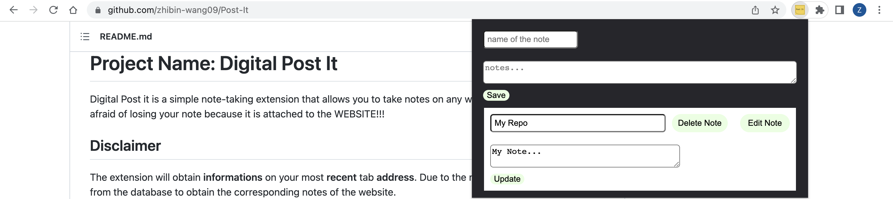

# Project Name: Digital Post It #
Digital Post it is a simple note-taking extension that allows you to take notes on any website. The notes will be organized base on the current tab. You will never be afraid of losing your note because it is attached to the WEBSITE!!!

## Disclaimer ##
The extension will obtain **informations** on your most **recent** tab **address**. Due to the necessity of fetching notes from the database to obtain the corresponding notes of the website.

## Set up ##
1) Clone the project
2) Navigate into the same directory as the project
3) Navigate into the same directory as the client folder
5) type "npm install"( this will install all the things you need to use this extension )
6) then "npm run build" ( this will create the extension)
7) Open Chrome browser
8) Head to "Manage Extensions"
9) Toggle on developer mode on the upper right corner
10) Load unpack the build folder that was generated after "npm run build" command
12) You're good to go!

## Usage ##
1) Navigate to the same directory as the project
2) Type command "npm start"
3) You're good to go!

**Remeber to make an account when you use the app**
**Write that information somewhere :)**
## Direction ##

*The example note is taken on the github.com. The note is taken and fetched according to the base URL.*
1. Enter the title of the note
2. Enter the body of the note
3. Click Save
4. Note will be rendered To the popup!!!

### How To Edit ###

1. Click the edit button
2. Type in any new information
3. Click update
